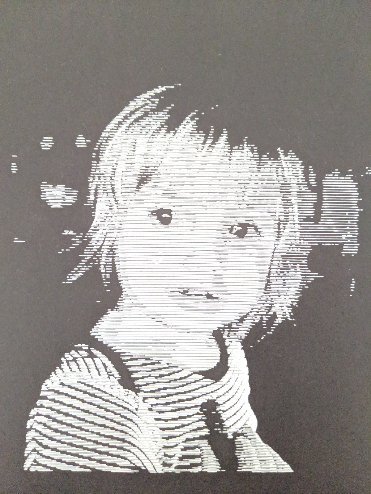

# RasterPlotter

[RasterPlotter.jar](RasterPlotter.jar) - Jar download: `java -jar RasterPlotter.jar`:

```
Usage: RasterPlotter pathToImage thresholdValue
```

Extremely naive image to svg tool. RasterPlotter assumes input image is a monochromatic dithered image with black and white pixels only, the output will appear negative/inverted, this is so it can be plotted by a pen plotter. `thresholdValue` only defines the minimum line length so the pen plotter doesn't attempt to draw hundreds of lines of length 1. There's an additional `-iso` argument that instructs the SVG output to only draw every other line, eg. `RasterPlotter.jar 10 -iso` (displayed in the photo below).

To use with [DitherKt](https://github.com/fiskurgit/DitherKt) where `jrun` is an alias to a Java JDK:

`jrun DitherCL.jar image.png 5x3Bayer | tail -1 | (read dithered; jrun RasterPlotter.jar "$dithered")`

Example output plotted using an [Axidraw](https://axidraw.com/):

